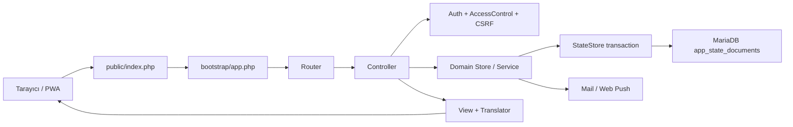

# MyTakii Mimari Ağacı

Bu belge, çalışan kodun güncel mimari haritasıdır. Makine tarafından doğrulanan
asıl envanter `config/architecture.php` dosyasındadır. Yeni rota, controller,
domain sınıfı, view veya durum belgesi eklendiğinde ikisi birlikte güncellenir.

## Mimari Karar

MyTakii, PHP 8.3 üzerinde çalışan sunucu taraflı bir **modüler monolittir**.
MariaDB kalıcı durum deposudur; Apache/Nginx yalnızca `public/` dizinini yayınlar.
Bu yaklaşım mevcut ürün ve ekip için doğru seviyededir: tek paket halinde kolay
yayınlanır, transaction sınırları nettir ve gereksiz servis operasyonu oluşturmaz.

```text
public/index.php                         HTTP giriş noktası
└── bootstrap/app.php                    Composition root ve rota kaydı
    ├── app/Controllers/                 HTTP, CSRF, yetki ve response akışı
    ├── app/Core/                        Ortak altyapı ve kimlik servisleri
    ├── app/Modules/                     Domain store ve servisleri
    │   ├── Auth/                        Parola ve personel kimlik bilgileri
    │   ├── Leave/                       İzin, onay, takvim ve defter imzası
    │   ├── Messaging/                   Konuşma ve okundu takibi
    │   ├── Notifications/               Web Push
    │   ├── Procurement/                 Satın alma talepleri
    │   ├── Shift/                       Shift, tatil ve nöbet planları
    │   ├── Templates/                   GrapesJS şablonları ve test maili
    │   └── Weather/                     Yeniden üretilebilir hava cache'i
    ├── resources/views/                 Yalnızca sunum
    ├── resources/lang/                  tr-TR, en-US, de-DE, ja-JP
    ├── config/architecture.php          Mimari sahiplik sözleşmesi
    └── app_state_documents              Transactional MariaDB durum deposu
```

## İstek Akışı



## Modül Sahipliği

| Modül | Ana sorumluluk | Kalıcı durum |
| --- | --- | --- |
| Identity | Giriş, oturum, parola sıfırlama, hız sınırı | `password_resets`, `password_reset_mail_outbox`, `rate_limits` |
| Personnel | Personel profili, kullanıcı adı, organizasyon | `user_profiles` |
| Admin | Yetki, departman, audit ve sürüm takibi | `access_control`, `audit_log`, `release_notes` |
| Leave | Talep, onay, takvim, iptal, defter imzası | `leave_requests`, `leave_mail_outbox`, `leave_signature_scheduler` |
| Messaging | Konuşma, okundu, pin, soft-delete | `messages` |
| Shift | Shift, şirket tatili, aylık özel nöbet | `shifts` |
| Procurement | Satın alma talepleri | `procurement` |
| Templates | Mail/rapor şablonu ve test maili | `templates`, `template_test_mail_outbox` |
| Notifications | Web Push aboneliği ve VAPID anahtarı | `push_subscriptions`, `vapid_keys` |
| Dashboard | Panel ve hava durumu | Yalnız yeniden üretilebilir `weather-cache.json` |

Her durum belgesi InnoDB transaction'ı içinde `SELECT ... FOR UPDATE` ile
kilitlenir. `revision` ve SHA-256 `checksum` kayıp güncelleme ile bozuk veriyi
tespit eder. Dosya sürücüsü yalnızca yerel test ve kontrollü geri dönüş içindir.

## Bağımlılık Kuralları

1. `public/` yalnız giriş ve statik dosyaları taşır.
2. `bootstrap/app.php` nesneleri kuran ve rotaları bağlayan tek composition root'tur.
3. Controller HTTP, kimlik, yetki, CSRF ve response akışını yönetir; kalıcı veriyi
   doğrudan yazmaz.
4. Domain store/service sınıfları controller katmanına bağımlı olamaz.
5. View dosyaları `PDO`, `Database`, `StateStore` veya dosya yazma API'lerini
   kullanamaz.
6. Modüller arası bağımlılık yalnız `config/architecture.php` içindeki açık izin
   listesiyle kurulabilir. Bugünkü bilinçli bağımlılık `Leave -> Shift` ilişkisidir.
7. Her rota, controller, domain sınıfı, view ve kalıcı belge tek bir modülün
   sahipliğinde olmalıdır.

Bu kurallar `tests/architecture-regression.php` tarafından otomatik doğrulanır.

## Büyümeye Uygunluk Değerlendirmesi

**Bugünkü sonuç:** Mimari mevcut şirket, 81 civarı personel ve yüzlerce kullanıcı
seviyesine büyümek için uygundur. Modül sınırları, transaction güvenliği,
kimlik taşıma işlemi ve istek içi cache doğru temellerdir.

**Ana kapasite sınırı:** İzin, mesaj, personel ve audit kayıtları bugün domain
başına tek bir `LONGTEXT` JSON belgesindedir. Aynı domain içindeki tüm yazmalar
aynı satır kilidini paylaşır ve liste okumaları belgenin tamamını çözer. Bu yapı
mevcut hacimde pratiktir; binlerce aktif kullanıcı, yüksek mesaj trafiği veya
çok şirketli SaaS için son hedef değildir.

Diğer büyüme sınırları:

- Oturumlar tek sunucunun PHP session mekanizmasına bağlıdır.
- Mail, push ve izin defteri zamanlayıcısı web isteğiyle senkron çalışabilir.
- Büyük listelerde veri tabanı seviyesinde sayfalama ve indeksli sorgu yoktur.
- Dosya yükleri için nesne depolama, merkezi log/metric ve kuyruk altyapısı yoktur.
- Verilerde henüz her kayda zorunlu `tenant_id` uygulanmamaktadır.

## Kontrollü Büyüme Yolu

1. **Şimdi:** Modüler monoliti koru; mimari test, release gate, ölçüm ve yedeklemeyi
   zorunlu tut. Erken mikroservis ayrıştırması yapma.
2. **Yük arttığında:** Önce `messages`, `audit_log`, `leave_requests` ve
   `user_profiles` belgelerini normalleştirilmiş, indeksli tablolara taşı. API ve
   ekranlarda sunucu taraflı sayfalama ekle.
3. **Çok şirketli satıştan önce:** Tüm iş kayıtlarına `tenant_id`, tenant kapsamlı
   unique/index kuralları ve tenant izolasyon testleri ekle.
4. **Birden fazla web sunucusundan önce:** Redis tabanlı session/cache, bağımsız
   queue worker, idempotent mail/push işleri ve nesne depolama ekle.
5. **Yatay büyümede:** PHP worker'ları stateless çalıştır; health check, merkezi
   log, hata takibi, latency/error-rate metrikleri ve alarm eşikleri kur.
6. Yalnız bağımsız ölçek ihtiyacı kanıtlanan modülü servis olarak ayır; önce
   mesajlaşma veya bildirim kuyrukları adaydır.

## Değişiklikten Canlıya Yayın Kapısı

```text
Mimari haritayı oku
        ↓
Kod + test + mimari kayıt birlikte değişsin
        ↓
composer verify:release
        ↓ yalnız tüm kontroller geçtiyse
Sürüm notu + commit + tag
        ↓
composer verify:release:record
        ↓
composer release:assert
        ↓
Yedek → immutable paket → giriş noktasını değiştir
        ↓
Canlı smoke + performans + log kontrolü
```

MariaDB entegrasyon testleri yalnız ayrı test veritabanında
`RELEASE_VERIFY_MARIADB=1` ile çalıştırılır. Üretim veritabanı hiçbir zaman test
hedefi değildir. Kapılardan biri başarısızsa önceki canlı sürüm aktif kalır.
